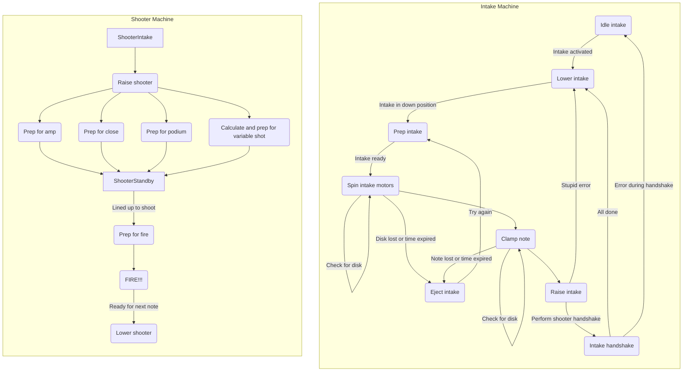

```mermaid

flowchart BT
    subgraph Intake Machine
        IdleIntake(Idle intake)-->|Intake activated|IntakeLower
        IntakeLower(Lower intake)-->|Intake in down position|PrepIntake(Prep intake)-->|Intake ready|SpinIntake(Spin intake motors)
        SpinIntake-->|Check for disk|SpinIntake
        SpinIntake-->|Disk lost or time expired|EjectIntake(Eject intake)
        EjectIntake-->|Try again|PrepIntake
        SpinIntake-->ClampNote(Clamp note)
        ClampNote-->|Check for disk|ClampNote
        ClampNote-->|Note lost or time expired|EjectIntake
        ClampNote-->IntakeRaise(Raise intake)
        IntakeRaise-->|Perform shooter handshake|IntakeHandshake(Intake handshake)
        IntakeRaise-->|Stupid error|IntakeLower
        IntakeHandshake-->|All done|IntakeLower
        IntakeHandshake-->|Error during handshake|IdleIntake
    end

    subgraph Shooter Machine
        ShooterLower(Lower shooter)
        ShooterIntake-->ShooterRaise(Raise shooter)

        PrepAmp(Prep for amp)
        PrepClose(Prep for close)
        PrepPodium(Prep for podium)
        PrepVariable(Calculate and prep for variable shot)

        ShooterRaise-->PrepAmp & PrepClose & PrepPodium & PrepVariable

        PrepAmp & PrepClose & PrepPodium & PrepVariable-->ShooterStandby
        ShooterStandby-->|Lined up to shoot|ShooterPrep(Prep for fire)
        ShooterPrep-->ShooterShoot(FIRE!!!)
        ShooterShoot-->|Ready for next note|ShooterLower
    end
```