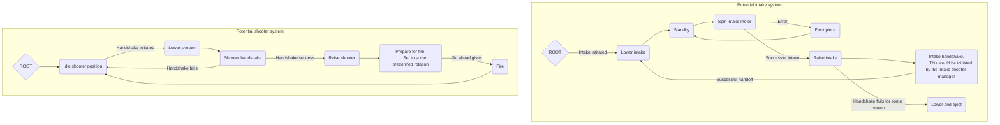

```mermaid
flowchart TB
    subgraph Potential intake system
        ROOT{ROOT}-->|Intake intitated|LowerIntake(Lower intake)
        LowerIntake-->LowerStandby(Standby)
        LowerStandby-->Spin(Spin intake motor)

        Spin-->|Error|Eject(Eject piece)
        Eject-->LowerStandby

        Spin-->|Successful intake|RaiseIntake(Raise intake)
        RaiseIntake-->IntakeHandshake(Intake handshake.
        This would be initiated by the intake shooter manager)
        RaiseIntake-->|Handshake fails for some reason|HandshakeEject(Lower and eject)

        IntakeHandshake-->|Successful handoff|LowerIntake
    end

    subgraph Potential shooter system
        SHOOTER_ROOT{ROOT}-->ShooterIdle(Idle shooter position)
        ShooterIdle-->|Handshake initiated|LowerShooter(Lower shooter)
        LowerShooter-->ShooterHandshake(Shooter handshake)
        ShooterHandshake-->|Handshake fails|ShooterIdle

        ShooterHandshake-->|Handshake success|RaiseShooter(Raise shooter)
        RaiseShooter-->PrepFire(Prepare for fire.
        Set to some predefined rotation)
        PrepFire-->|Go ahead given|Fire(Fire)
        Fire-->ShooterIdle
    end
```