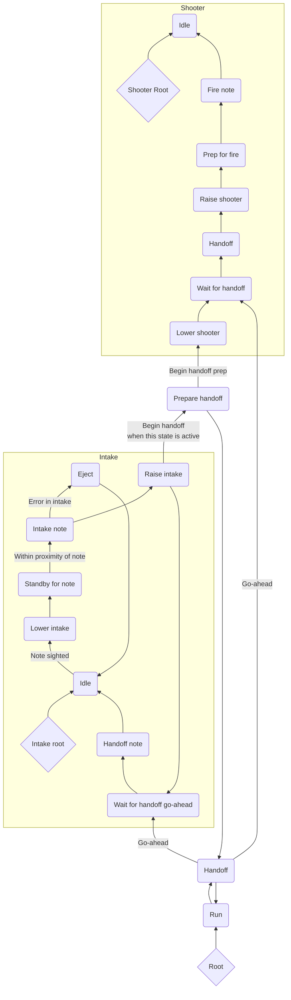

```mermaid
flowchart BT
    mRoot{Root}
    mRun(Run)
    mPrepHandoff(Prepare handoff)
    mHandoff(Handoff)

    mRoot-->mRun
    mRun-->mHandoff
    mHandoff-->mRun

    subgraph Shooter
        sRoot{Shooter Root}
        sIdle(Idle)
        sLower(Lower shooter)
        sWaitForHandoff(Wait for handoff)
        sHandoff(Handoff)
        sRaise(Raise shooter)
        sPrep(Prep for fire)
        sFire(Fire note)

        sRoot-->sIdle
        sLower-->sWaitForHandoff
        sWaitForHandoff-->sHandoff
        sHandoff-->sRaise
        sRaise-->sPrep
        sPrep-->sFire
        sFire-->sIdle
    end

    subgraph Intake
        iRoot{Intake root}
        iIdle(Idle)
        iLower(Lower intake)
        iStandby(Standby for note)
        iIntake(Intake note)
        iEject(Eject)
        iRaise(Raise intake)
        iWaitForHandoff(Wait for handoff go-ahead)
        iHandoff(Handoff note)

        iRoot-->iIdle
        iIdle-->|Note sighted|iLower
        iLower-->iStandby
        iStandby-->|Within proximity of note|iIntake
        iIntake-->|Error in intake|iEject-->iIdle
        iIntake-->iRaise

        iRaise-->iWaitForHandoff
        iWaitForHandoff-->iHandoff
        iHandoff-->iIdle
    end

    iRaise-->|Begin handoff 
    when this state is active|mPrepHandoff
    mPrepHandoff-->mHandoff
    mHandoff-->|Go-ahead|iWaitForHandoff

    mPrepHandoff-->|Begin handoff prep|sLower
    mHandoff-->|Go-ahead|sWaitForHandoff
```