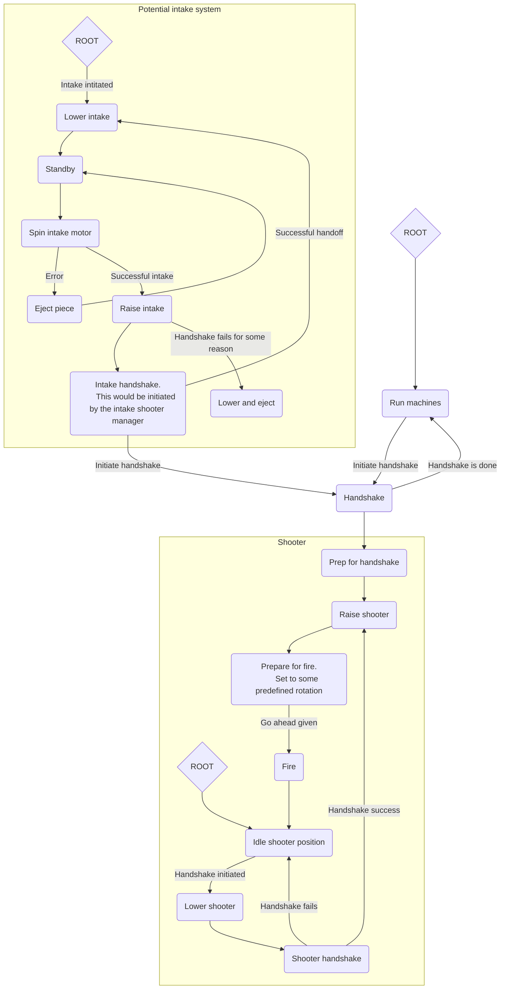

```mermaid
flowchart TB
    mRoot{ROOT}--->mRun(Run machines)
    mRun-->|Initiate handshake|mHand(Handshake)

    subgraph Potential intake system
        direction TB
        ROOT{ROOT}-->|Intake intitated|LowerIntake(Lower intake)
        LowerIntake-->LowerStandby(Standby)
        LowerStandby-->Spin(Spin intake motor)

        Spin-->|Error|Eject(Eject piece)
        Eject-->LowerStandby

        Spin-->|Successful intake|RaiseIntake(Raise intake)
        RaiseIntake-->IntakeHandshake(Intake handshake.
        This would be initiated by the intake shooter manager)
        RaiseIntake-->|Handshake fails for some reason|HandshakeEject(Lower and eject)

        IntakeHandshake-->|Successful handoff|LowerIntake
    end

    subgraph Shooter
        direction TB
        SHOOTER_ROOT{ROOT}-->ShooterIdle(Idle shooter position)
        ShooterIdle-->|Handshake initiated|LowerShooter(Lower shooter)
        LowerShooter-->ShooterHandshake(Shooter handshake)
        ShooterHandshake-->|Handshake fails|ShooterIdle

        ShooterHandshake-->|Handshake success|RaiseShooter(Raise shooter)
        RaiseShooter-->PrepFire(Prepare for fire.
        Set to some predefined rotation)
        PrepFire-->|Go ahead given|Fire(Fire)
        Fire-->ShooterIdle
        PrepForHandShooter(Prep for handshake)-->RaiseShooter
    end


    IntakeHandshake-->|Initiate handshake|mHand
    mHand-->PrepForHandShooter
    mHand-->|Handshake is done|mRun
```